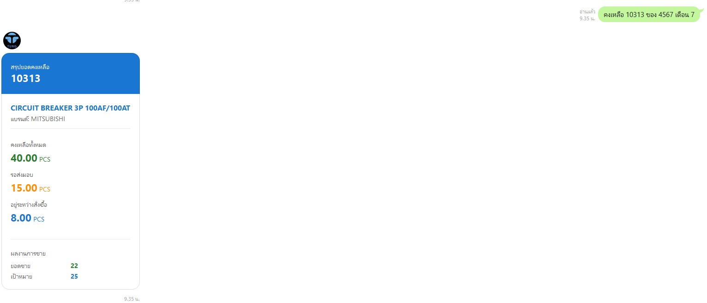
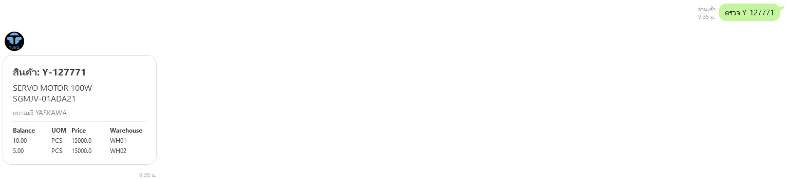

# 📦 Line Chatbot for Forecasting-System

ระบบ Line Chatbot นี้ถูกพัฒนาขึ้นเพื่อใช้งานร่วมกับระบบ **Forecasting-System** โดยมีวัตถุประสงค์เพื่อให้ผู้ใช้งานสามารถตรวจสอบ **ยอดคงเหลือของสินค้า** ในส่วนของตนเองได้อย่าง **สะดวกและรวดเร็ว**

## 🧾 วิธีการใช้งาน

### 1. ตรวจสอบยอดคงเหลือของตนเอง
พิมพ์ข้อความในรูปแบบ:
คงเหลือ [รหัสสินค้า] ของ [รหัสเซลส์] เดือน [เลขเดือน]
**ตัวอย่าง:**
คงเหลือ 10313 ของ 4567 เดือน 7

ระบบจะคำนวณยอดคงเหลือจาก:
ยอดคงเหลือ = ยอด Forecasting - ยอดขายของเดือนนั้นๆ

และแสดงผลลัพธ์ทันที

### 2. ตรวจสอบยอดสินค้าคงเหลือรวมในคลัง
พิมพ์ข้อความในรูปแบบ:
ตรวจ [รหัสสินค้า]
**ตัวอย่าง:**
ตรวจ Y-127771

ระบบจะแสดงยอดสินค้าคงเหลือรวมในคลังทั้งหมด ซึ่งมีประโยชน์ในกรณีที่สินค้าของเซลส์ไม่เพียงพอ และต้องการขอแบ่งจากผู้อื่น

## 🎯 วัตถุประสงค์ของระบบ

- แก้ไขปัญหาที่พนักงานขายไม่สามารถเข้าถึงข้อมูลยอดคงเหลือได้ด้วยตนเอง
- ลดการพึ่งพาฝ่ายอื่น และลดเวลารอข้อมูล
- ป้องกันการรับออเดอร์เกินจำนวนที่มีในสต็อก
- เพิ่มโอกาสในการขายด้วยการตอบสนองลูกค้าได้รวดเร็ว

## 🚀 ประโยชน์ที่ได้รับ

- ลดการเสียโอกาสทางการขายจากสินค้าขาดสต็อก
- เพิ่มความสามารถในการประสานงานและแบ่งปันสต็อกภายในทีม
- สะดวก ใช้งานง่ายผ่าน Line ด้วยภาษาธรรมชาติ

## ผู้พัฒนา
ธนภัทร โสภณ